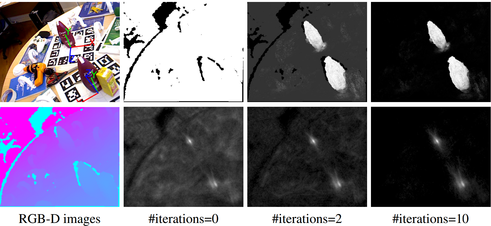
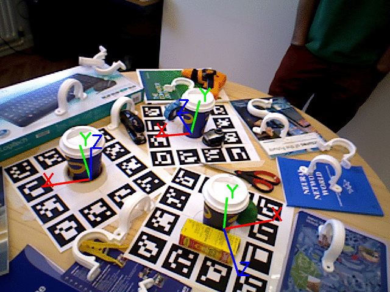

# Latent-Class Hough Forests for Object Detection and Pose Estimation - PAMI 2017 ECCV 2014



## Abstract
In this paper we propose a novel framework, Latent-Class Hough Forests, for 3D object detection and pose estimation in heavily cluttered and occluded scenes. Firstly, we adapt the state-of-the-art template matching feature, LINEMOD [1], into a scale-invariant patch descriptor and integrate it into a regression forest using a novel template-based split function. In training, rather than explicitly collecting representative negative samples, our method is trained on positive samples only and we treat the class distributions at the leaf nodes as latent variables. During the inference process we iteratively update these distributions, providing accurate estimation of background clutter and foreground occlusions and thus a better detection rate. Furthermore, as a by-product, the latent class distributions can provide accurate occlusion aware segmentation masks, even in the multi-instance scenario. In addition to an existing public dataset, which contains only single-instance sequences with large amounts of clutter, we have collected a new, more challenging, dataset for multiple-instance detection containing heavy 2D and 3D clutter as well as foreground occlusions. We evaluate the Latent-Class Hough Forest on both of these datasets where we outperform state of the art methods.

## Contributions
- We propose the Latent-Class Hough Forest, a novel patch-based approach to 3D object detection and pose estimation; It performs one-class learning at the training stage, and iteratively infers latent class distributions at test time.
- We adapt the state of the art 3D holistic template feature, LINEMOD [1], to be a scale invariant patch descriptor and integrate it into the random forest framework via a novel template-based splitting function
- During the inference stage, we jointly estimate the objects 3D location and pose as well as a pixel wise visibility map, which can be used as an occlusion aware figure-ground segmentation for result refinement.
- We provide a new, more challenging public dataset for multi-instance 3D object detection and pose estimation, comprising near and far range 2D and 3D clutter as well as foreground occlusions.

## Videos
[Video 1](https://www.youtube.com/watch?v=R-ZdKxgGq4A)
[Video 1](https://www.youtube.com/watch?v=idY3Q7wg5rk)
[Video 1](https://www.youtube.com/watch?v=dh2VtnnsGuY)

## Downloads
[Paper](./docs/ECCV_2014.pdf)
[Poster](./docs/ECCV_2014_poster.pdf)

## Dataset
[Read info](./dataset/info.txt) - [Old object models 12.9MB](./dataset/Meshes.zip) - [New object models 16.7MB](./dataset/new_models.zip)

Updated annotation for: [Old object models 2.4MB](./dataset/annotation_old_models.zip) - [New object models 2.4MB](./dataset/annotation_new_models.zip)

Objects: [Coffee cup 809MB](https://drive.google.com/file/d/1wQ64Lka3Q4wa9Ud_AJIWoUr0QDR4Kbd7/view?usp=sharing) - [Shampoo 1.16GB](https://drive.google.com/file/d/12-AAFlrmADh9Q59n2hMVwH0tMNyTXJYr/view?usp=sharing) - [Joystick 1.17GB](https://drive.google.com/file/d/1_efP-vKkXzcNBg08Y4wqDSA2yXL93m_i/view?usp=sharing) - [Camera 820 MB](https://drive.google.com/file/d/1NH1MB3UqPEx6tpHLnEO-eTp6xBBRnaLw/view?usp=sharing) - [Juice carton 980MB](https://drive.google.com/file/d/1P-jtj1tslZpgdormsjDePNH2A5n3nrqN/view?usp=sharing) - [Milk 962MB](https://drive.google.com/file/d/1WoyHAivf37Nm5sSxFYoTdRVq3b_ktDH2/view?usp=sharing)

If you make use of the dataset please cite:
```
@article{tejani2017latent,
  title={Latent-class hough forests for 6 DoF object pose estimation},
  author={Tejani, Alykhan and Kouskouridas, Rigas and Doumanoglou, Andreas and Tang, Danhang and Kim, Tae-Kyun},
  journal={IEEE transactions on pattern analysis and machine intelligence},
  volume={40},
  number={1},
  pages={119--132},
  year={2017},
  publisher={IEEE}
}
```
```
@inproceedings{tejani2014latent,
  title={Latent-class hough forests for 3D object detection and pose estimation},
  author={Tejani, Alykhan and Tang, Danhang and Kouskouridas, Rigas and Kim, Tae-Kyun},
  booktitle={European Conference on Computer Vision},
  pages={462--477},
  year={2014},
  organization={Springer}
}
```